# Architecture Document — Dispute Triage System

> Internal prototype for banking operations users to triage and route customer payment disputes.
> Reference: [`docs/requirements.md`](./requirements.md), [`docs/use-cases.md`](./use-cases.md), [`.kiro/steering/product.md`](../.kiro/steering/product.md).

---

## 1. Quality Goals & Architectural Drivers

These are the top-level quality attributes that shaped every architectural decision in this system. They are ordered by priority — when goals conflict, higher-ranked goals win.

| Priority | Quality Goal | Architectural Approach | Measured By |
|:---:|---|---|---|
| 1 | **Transparency** | Every triage recommendation includes a full rule trace showing inputs, conditions, and outcomes. The ops user always sees *why*, not just *what*. | Rule trace visible on every dispute detail view. No opaque decisions. |
| 2 | **Determinism** | Triage engine is a pure function. Same inputs always produce the same output. No randomness, no ML, no external state. | Unit tests exhaustively cover the 2x2 rule matrix. |
| 3 | **Testability** | Domain logic separated from infrastructure. Pure functions with no side effects. Dependency injection via function parameters. | 100% of triage and lifecycle logic testable without mocks or database. |
| 4 | **Maintainability** | Strict 4-tier layer separation. Single responsibility per module. TypeScript contracts enforce boundaries. | No cross-layer imports. Each module has one reason to change. |
| 5 | **Developer Ergonomics** | Hot reload, type safety end-to-end, single `npm install`, one command to run everything. | New developer productive within minutes. Zero configuration. |

**Stakeholder:** Internal banking operations user (single actor for this prototype).

---

## 2. System Context

The Dispute Triage System is a self-contained internal operations tool. It has no external integrations — all data is mock/seeded locally. A single actor (the ops user) interacts with the system through a browser-based dashboard.

```
┌─────────────────────────────────────────────────────────────────┐
│                     OPS USER (Browser)                           │
│         Desktop-first Operations Portal (>= 1024px)             │
└────────────────────────────────┬────────────────────────────────┘
                                 │ HTTP (JSON)
                                 ▼
┌─────────────────────────────────────────────────────────────────┐
│              DISPUTE TRIAGE SYSTEM (localhost)                   │
│   Frontend :5173  ──proxy /api/*──►  Backend :3001              │
│   (React + Vite)                     (Express + Prisma)         │
│                                          │                      │
│                                          ▼                      │
│                                   SQLite (.db file)             │
└─────────────────────────────────────────────────────────────────┘
```

**Diagram notation:** Boxes = system boundaries. Arrows = data flow direction (protocol labelled). Ports = network listeners.

**Boundary:** Everything runs on the developer's machine. No cloud infrastructure, no external APIs, no authentication layer.

---

## 3. Components

| Component | Responsibility | Technology |
|-----------|---------------|------------|
| **Presentation Layer** | Desktop-first ops portal — dispute queue, detail views, forms, status lifecycle indicators | React 18, Vite 5, Tailwind CSS 3 |
| **Application / API Surface** | Stateless REST endpoints, request validation, response shaping (DTOs) | Express 4, TypeScript |
| **Domain Layer** | Business logic — triage engine, lifecycle state guard, rule evaluation | Pure TypeScript services (no framework coupling) |
| **Data Access Layer** | Object-relational mapping, migrations, seed data | Prisma 5, SQLite |

---

## 4. Tier Architecture

The system follows a strict 4-tier layered architecture. Each layer only communicates with its immediate neighbour. Dependencies point inward (Presentation → API → Domain → Data Access).

```
┌────────────────────────────────────────────────────────────────────────┐
│                          PRESENTATION LAYER                            │
│  - Desktop-First Operations Portal (Workspace Grid Design)            │
│  - Interactive Queue Filters & Status Lifecycle Indicators             │
│  - React components with data-testid attributes                       │
└───────────────────────────────────┬────────────────────────────────────┘
                                    │ Unified JSON Transfer Model (DTO)
                                    ▼
┌────────────────────────────────────────────────────────────────────────┐
│                        APPLICATION / API SURFACE                       │
│  - Stateless Resource Endpoints (/api/disputes, /api/customers)       │
│  - Inbound Contract Structural Schema Validation                      │
│  - Thin route handlers: validate → delegate → respond                 │
└───────────────────────────────────┬────────────────────────────────────┘
                                    │ Model Inversion / Dependency Injection
                                    ▼
┌────────────────────────────────────────────────────────────────────────┐
│                             DOMAIN LAYER                               │
│  ┌──────────────────────────────┐    ┌──────────────────────────────┐ │
│  │  Deterministic Triage Engine │    │  Lifecycle State Guard       │ │
│  │  - Predicate Evaluator       │    │  - Linear Finite State FSM  │ │
│  │  - Log Trace Transformer     │    │  - Transition Assertions    │ │
│  └──────────────────────────────┘    └──────────────────────────────┘ │
└───────────────────────────────────┬────────────────────────────────────┘
                                    │ Relational Mapping Context
                                    ▼
┌────────────────────────────────────────────────────────────────────────┐
│                          DATA ACCESS LAYER                             │
│  - Prisma ORM (Object-Relational Mapper)                              │
│  - Disk-Backed Transactional SQLite Data Store                        │
│  - Seeded test data via Prisma seed script                            │
└────────────────────────────────────────────────────────────────────────┘
```

**Diagram notation:** Stacked boxes = layers (top-to-bottom = user-facing to infrastructure). Arrows = dependency direction. Labels on arrows = communication mechanism.

### Layer Responsibilities

| Layer | Does | Does NOT |
|-------|------|----------|
| Presentation | Render UI, capture user input, call API, display responses | Contain business logic, access DB directly |
| API Surface | Validate request shape, route to services, format responses, handle errors | Know triage rules, own state transitions |
| Domain | Evaluate triage rules, guard status transitions, compute derived values | Know about HTTP, Prisma, or React |
| Data Access | Persist and query entities, run migrations and seeds | Contain business logic or validation rules |

---

## 5. Data Model

### 5.1 Entity Relationship Diagram

```
                    ┌──────────────────────────┐
                    │         CUSTOMER         │
                    ├──────────────────────────┤
                    │ id: Int [PK, autoincr]   │
                    │ name: String             │
                    │ contactReference: String  │
                    │ accountIdentifier: String │
                    │ createdAt: DateTime       │
                    └────────────┬─────────────┘
                                 │
                                 │ 1
                                 │
                                 │ 0..*
                    ┌────────────▼─────────────┐
                    │         DISPUTE          │
                    ├──────────────────────────┤
                    │ id: Int [PK, autoincr]   │
                    │ customerId: Int [FK]     │
                    │ status: StatusEnum       │
                    │ category: String (fixed) │
                    │ totalAmount: Decimal     │
                    │ dateRaised: DateTime     │
                    │ priority: PriorityEnum   │
                    │ recommendation: String   │
                    │ ruleTrace: String (JSON) │
                    │ resolutionOutcome: Enum? │
                    │ createdAt: DateTime      │
                    │ updatedAt: DateTime      │
                    └────────────┬─────────────┘
                                 │
                                 │ 1
                                 │
                                 │ 1..*
                    ┌────────────▼─────────────┐
                    │       TRANSACTION        │
                    ├──────────────────────────┤
                    │ id: Int [PK, autoincr]   │
                    │ disputeId: Int [FK]      │
                    │ amount: Decimal          │
                    │ merchant: String         │
                    │ timestamp: DateTime      │
                    │ paymentType: TypeEnum    │
                    │ createdAt: DateTime      │
                    └──────────────────────────┘
```

**Diagram notation:** `[PK]` = primary key, `[FK]` = foreign key, `1` / `0..*` / `1..*` = cardinality. `▼` = "has many" direction.

### 5.2 Enumerations

| Enum | Values |
|------|--------|
| **Status** | `Reported`, `UnderInvestigation`, `Escalated`, `Resolved`, `Referred` |
| **Priority** | `P1`, `P2`, `Standard` |
| **PaymentType** | `Card`, `ApplePay`, `EFT` |
| **ResolutionOutcome** | `Refunded`, `Declined`, `ChargebackInitiated` |

### 5.3 Key Constraints

- `totalAmount` is a **derived field** — always equals `SUM(transactions.amount)`. Recalculated when transactions are added.
- `ruleTrace` stores the structured trace object (see requirements §4.4 for schema) as a serialized JSON string in SQLite. Parsed by the API layer before responding to the client.
- `resolutionOutcome` is nullable — only set when status transitions to `Resolved`.
- `category` is always `"Unauthorised/Fraudulent Charge"` for this prototype.
- Integer auto-increment primary keys (SQLite-optimized, simpler than UUIDs for a prototype).

---

## 6. End-to-End Process Flow

The complete dispute lifecycle from intake through resolution, showing how the triage engine and operations desk interact:

```mermaid
%%{init: {'theme': 'base', 'themeVariables': { 'primaryColor': '#ffffff', 'edgeLabelBackground':'#ffffff', 'tertiaryColor': '#f3f4f6'}}}%%

graph LR

    %% Layer/Phase Boundaries (Horizontal Swimlanes)

    subgraph Phase1["1. INTAKE & INGESTION (Day 0)"]
        A["Customer Reports Fraud"] --> B["Case Created: 'Reported'"]
    end

    subgraph Phase2["2. AUTOMATED TRIAGE (Instantaneous)"]
        B --> C{"Pure Triage Engine"}

        %% Rule Routing Matrix
        C -->|R1: Age < 48h\nR2: Amount > R10k| D1["P1 High Priority\nImmediate Fraud Freeze"]
        C -->|R1: Age > 48h\nR2: Amount > R10k| D2["P1 High Priority\nEscalate Queue"]
        C -->|R1: Age < 48h\nR2: Amount < R10k| D3["P2 Medium Priority\nCard Freeze Only"]
        C -->|R1: Age > 48h\nR2: Amount < R10k| D4["Standard Priority\nRegular Queue"]
    end

    subgraph Phase3["3. OPERATIONS DESK (Active Lifecycle)"]
        D1 & D2 & D3 & D4 --> E["Under Investigation"]

        %% Operational Actions Loop
        E -->|Optional: Append\nNew Transactions| C
        E -->|If High Complexity| F["Escalated Team"]
        E -->|Need Customer Data| G["Referred to Client"]
    end

    subgraph Phase4["4. TERMINAL RESOLUTION (Closure)"]
        F & E --> H{"Select Final Outcome"}

        %% Structured Outcomes
        H -->|Valid Legitimate Claim| I1["Refunded\n(Funds Reverted)"]
        H -->|Card Network Recovery| I2["Chargeback Initiated\n(Visa/MC Dispute)"]
        H -->|Dispute Rejected| I3["Declined\n(Deemed Genuine)"]

        I1 & I2 & I3 --> J[("Case State: 'Resolved'")]
    end

    %% Class/Styling Definitions
    classDef intake fill:#eff6ff,stroke:#1d4ed8,stroke-width:2px,color:#1e3a8a;
    classDef engine fill:#fff7ed,stroke:#ea580c,stroke-width:2px,color:#7c2d12;
    classDef p1 fill:#fef2f2,stroke:#dc2626,stroke-width:2px,color:#7f1d1d;
    classDef p2 fill:#fffbeb,stroke:#d97706,stroke-width:2px,color:#78350f;
    classDef std fill:#f9fafb,stroke:#4b5563,stroke-width:2px,color:#111827;
    classDef ops fill:#f3e8ff,stroke:#7e22ce,stroke-width:2px,color:#581c87;
    classDef terminal fill:#ecfdf5,stroke:#059669,stroke-width:2px,color:#064e3b;

    %% Assigning styles
    class A,B intake;
    class C engine;
    class D1,D2 p1;
    class D3 p2;
    class D4 std;
    class E,F,G ops;
    class H,I1,I2,I3,J terminal;

    %% Container box styling
    style Phase1 fill:#f8fafc,stroke:#cbd5e1,stroke-width:1px;
    style Phase2 fill:#f8fafc,stroke:#cbd5e1,stroke-width:1px;
    style Phase3 fill:#f8fafc,stroke:#cbd5e1,stroke-width:1px;
    style Phase4 fill:#f8fafc,stroke:#cbd5e1,stroke-width:1px;
```



### Phase Summary

| Phase | What Happens | Key Architectural Component |
|-------|-------------|----------------------------|
| 1. Intake | Customer reports fraud → ops user creates case with transactions | API Surface (POST /api/disputes) |
| 2. Automated Triage | Pure triage engine evaluates R1 (age) + R2 (amount) → assigns priority + recommendation | Domain Layer (triageEngine.ts) |
| 3. Operations Desk | Ops user investigates, may add transactions (triggers re-triage), escalate, or refer | Lifecycle Guard + Triage Engine |
| 4. Terminal Resolution | Case closed with structured outcome (Refunded / Chargeback / Declined) | Lifecycle Guard (FSM terminal state) |

**Key feedback loop:** When new transactions are appended during Phase 3, the flow returns to Phase 2 for re-evaluation. This is the triage re-evaluation trigger documented in requirements REQ-037.

---

## 7. Domain Logic — Building Blocks

### 7.1 Deterministic Triage Engine

The triage engine is a pure function. It takes inputs and produces a deterministic output with no side effects. This makes it trivially testable and transparent.

```
┌──────────────────────────────┐
│ INBOUND PAYLOAD              │
│ - dispute.dateRaised         │
│ - Array of transaction items │
└──────────────┬───────────────┘
               │
               ▼
┌──────────────────────────────┐
│ AGE INTERCEPTOR (R1)         │
│ Evaluates if:                │
│ (dateRaised - timestamp)     │
│ is less than 48 Hours        │
│ for ANY linked transaction   │
└──────────────┬───────────────┘
               │
               ▼
┌──────────────────────────────┐
│ BALANCE AGGREGATOR (R2)      │
│ Compiles SUM of all amounts. │
│ Evaluates if Sum > R10,000   │
└──────────────┬───────────────┘
               │
               ▼
┌──────────────────────────────┐
│ DETERMINISTIC OUTPUT MATRIX  │
│ Matches R1 & R2 flags against│
│ rule matrix conditions       │
└──────────────┬───────────────┘
               │
               ▼
┌───────────────────────────────────────────────────────────┐
│ STANDARDIZED RESPONSE PAYLOAD                             │
│ - priority: ('P1' | 'P2' | 'Standard')                   │
│ - recommendation: String Strategy Statement               │
│ - ruleTrace: JSON Verification Structural Payload         │
└───────────────────────────────────────────────────────────┘
```

**Diagram notation:** Boxes = processing stages (top-to-bottom = execution order). `▼` = data flows to next stage.

**Rule Matrix:**

| R1 (Age < 48h) | R2 (Amount > R10K) | Priority | Recommendation |
|:---:|:---:|:---:|---|
| true | true | P1 | Immediate Fraud Freeze + P1 High Priority Escalation |
| false | true | P1 | P1 High Priority Escalation |
| true | false | P2 | Immediate Fraud Freeze |
| false | false | Standard | Standard Investigation |

**Design choices:**
- The engine is a **pure function** (`evaluateTriage(dateRaised, transactions) → TriageResult`). No database access, no side effects.
- Rule trace is always produced alongside the recommendation — transparency is non-negotiable (Quality Goal #1).
- Re-evaluation is triggered by the API layer, not by the engine itself. The engine has no awareness of "when" it runs.

### 7.2 Lifecycle State Guard

The state guard enforces the status finite state machine. It is a pure validation function that accepts a current status and a proposed next status, returning a boolean or throwing an error.

```
            ┌──────────┐
            │ Reported │
            └────┬─────┘
                 │
                 ▼
       ┌─────────────────────┐
       │ Under Investigation  │
       └──┬───────┬───────┬──┘
          │       │       │
          ▼       ▼       ▼
   ┌──────────┐ ┌────────┐ ┌─────────┐
   │ Escalated│ │Resolved│ │ Referred│
   └────┬─────┘ └────────┘ └─────────┘
        │         (terminal)  (terminal)
        ▼
   ┌─────────┐
   │ Resolved│
   └─────────┘
    (terminal)
```

**Diagram notation:** Boxes = states. Arrows = valid transitions (direction only). `(terminal)` = no outbound transitions.

**Valid transitions (adjacency list):**

```typescript
const VALID_TRANSITIONS: Record<Status, Status[]> = {
  Reported: ['UnderInvestigation'],
  UnderInvestigation: ['Escalated', 'Resolved', 'Referred'],
  Escalated: ['Resolved'],
  Resolved: [],   // terminal
  Referred: [],   // terminal
};
```

**Guard rules:**
- Transitioning to `Resolved` requires a `resolutionOutcome` value.
- Transitioning to `Referred` requires no additional input.
- Terminal states (`Resolved`, `Referred`) reject all transition attempts.
- All other invalid transitions produce a structured error (`INVALID_STATUS_TRANSITION`).

---

## 8. Runtime View — Key Interaction Flows

### 8.1 Create Dispute (POST /api/disputes)

```
Ops UI                  API Route            Lifecycle Guard    Triage Engine     Database
  │                        │                      │                 │                │
  │──POST /api/disputes───►│                      │                 │                │
  │  (customerId,          │                      │                 │                │
  │   transactions[])      │                      │                 │                │
  │                        │                      │                 │                │
  │                        │──validate input──────►                 │                │
  │                        │                      │                 │                │
  │                        │──evaluateTriage(now, transactions)────►│                │
  │                        │                      │                 │                │
  │                        │◄──TriageResult (priority, rec, trace)──│                │
  │                        │                      │                 │                │
  │                        │──create dispute + transactions (atomic)────────────────►│
  │                        │                      │                 │                │
  │                        │◄──────────────────────────── created entity ────────────│
  │                        │                      │                 │                │
  │◄──HTTP 201 (dispute)───│                      │                 │                │
  │                        │                      │                 │                │
```

### 8.2 Add Transaction (POST /api/disputes/:id/transactions)

This is the most complex interaction. The sequence below reflects the team's detailed design:

```
Ops UI               API Controller       Lifecycle Guard    SQLite DB        Triage Engine
  │                       │                     │                │                 │
  │─POST /disputes/:id/  │                     │                │                 │
  │  transactions (DTO)──►│                     │                │                 │
  │                       │                     │                │                 │
  │                       │──fetch dispute + transactions───────►│                 │
  │                       │                     │                │                 │
  │                       │◄──dispute entity + transactions list─│                 │
  │                       │                     │                │                 │
  │                       │──validateStatusTransition(current)──►│                 │
  │                       │                     │                │                 │
  │                       │      Confirms case state is          │                 │
  │                       │      not terminal                    │                 │
  │                       │                     │                │                 │
  │                       │◄──Transition Permitted (true)────────│                 │
  │                       │                     │                │                 │
  │                       │  Appends new transaction             │                 │
  │                       │  to list in-memory                   │                 │
  │                       │                     │                │                 │
  │                       │──evaluateTriage(dateRaised, updatedList)──────────────►│
  │                       │                     │                │                 │
  │                       │         Computes R1 (age) and R2 (sum)                 │
  │                       │                     │                │                 │
  │                       │◄──TriageResult (Priority, Rec, Trace JSON)─────────────│
  │                       │                     │                │                 │
  │                       │──update dispute & create transaction (atomic)─────────►│
  │                       │                     │                │                 │
  │                       │◄──Data Commit Success────────────────│                 │
  │                       │                     │                │                 │
  │◄──HTTP 200 (updated  │                     │                │                 │
  │   dispute payload)────│                     │                │                 │
```

**Diagram notation:** Columns = participants (building blocks). `──►` = synchronous call. `◄──` = response. Vertical time flows downward.

**Key guarantees:**
- The lifecycle guard confirms the dispute is not in a terminal state before allowing a transaction to be added.
- Triage re-evaluation uses the **complete** transaction list (existing + new) before persisting.
- The database write is atomic — dispute update and transaction insert succeed or fail together.

### 8.3 Status Transition (PATCH /api/disputes/:id/status)

```
Ops UI               API Controller       Lifecycle Guard    Database
  │                       │                     │                │
  │─PATCH /disputes/:id/ │                     │                │
  │  status (newStatus,  │                     │                │
  │  resolutionOutcome?) │                     │                │
  │                       │                     │                │
  │                       │──validateTransition(current, next)──►│
  │                       │                     │                │
  │                       │◄──valid / invalid───│                │
  │                       │                     │                │
  │                       │  (if Resolved, validate outcome)     │
  │                       │                     │                │
  │                       │──update status─────────────────────►│
  │                       │                     │                │
  │                       │◄──updated entity────────────────────│
  │                       │                     │                │
  │◄──HTTP 200 (dispute)──│                     │                │
```

---

## 9. API Surface

RESTful JSON API under `/api`. All amounts in ZAR as numbers.

| Method | Endpoint | Description |
|--------|----------|-------------|
| GET | `/api/disputes` | List disputes. Query: `status`, `priority`, `sortBy`, `sortOrder` |
| GET | `/api/disputes/:id` | Dispute detail (includes customer, transactions, triage) |
| POST | `/api/disputes` | Create dispute with transactions. Triggers triage. |
| PATCH | `/api/disputes/:id/status` | Progress status. Body: `{ status, resolutionOutcome? }` |
| POST | `/api/disputes/:id/transactions` | Add transaction. Triggers triage re-evaluation. |
| GET | `/api/customers` | List all customers (for creation dropdown) |

**Error envelope:**
```json
{
  "error": {
    "code": "INVALID_STATUS_TRANSITION",
    "message": "Cannot transition from 'Reported' to 'Resolved'.",
    "status": 400,
    "timestamp": "2025-06-22T10:00:00.000Z"
  }
}
```

---

## 10. Project Structure (Module Mapping)

```
server/
├── prisma/
│   ├── schema.prisma          # Entity definitions, enums, relations
│   ├── migrations/            # Auto-generated migration history
│   └── seed.ts                # Seed data (customers, disputes, transactions)
├── src/
│   ├── index.ts               # App entry — middleware, routes, server start
│   ├── routes/
│   │   └── api.ts             # Thin route handlers (validate → delegate → respond)
│   ├── services/
│   │   ├── triageEngine.ts    # Pure function: evaluateTriage(dateRaised, transactions)
│   │   ├── lifecycleGuard.ts  # Pure function: validateTransition(current, next)
│   │   └── disputeService.ts  # Orchestration: DB queries + domain logic composition
│   └── middleware/
│       └── errorHandler.ts    # Centralized error handling (AppError → JSON response)
└── tests/
    ├── triageEngine.test.ts   # Unit tests for all rule matrix combinations
    ├── lifecycleGuard.test.ts # Unit tests for valid/invalid transitions
    └── disputeService.test.ts # Integration tests for service orchestration

client/
├── src/
│   ├── main.tsx               # React mount point
│   ├── App.tsx                # Root component + routing (react-router-dom)
│   ├── pages/
│   │   ├── Dashboard.tsx      # Dispute queue with filters and sorting
│   │   ├── CreateDispute.tsx  # New dispute form (customer + transactions)
│   │   └── DisputeDetail.tsx  # Detail view: triage, transactions, actions
│   ├── components/
│   │   ├── DisputeTable.tsx   # Sortable, filterable dispute list
│   │   ├── StatusBadge.tsx    # Color-coded status indicator
│   │   ├── PriorityBadge.tsx  # P1=red, P2=amber, Standard=grey
│   │   ├── RuleTrace.tsx      # Expandable triage rule trace display
│   │   ├── TransactionForm.tsx # Reusable transaction entry form
│   │   └── StatusActions.tsx  # Valid transition buttons per current state
│   └── hooks/
│       ├── useDisputes.ts     # Fetch + filter + sort disputes
│       └── useDisputeDetail.ts # Fetch single dispute with relations
├── tests/                     # Vitest + Testing Library component tests
└── e2e/                       # Playwright E2E (full user journeys)
```

---

## 11. Integrations

| System | Connection | Status |
|--------|-----------|--------|
| Banking / Card networks | None | Out of scope — all data is seeded |
| Payment processing | None | Simulated (mock seed data only) |
| Notification services | None | Out of scope |
| Authentication provider | None | Open access — prototype |

This is a fully self-contained prototype. The only "integration" is between the frontend and backend via the Vite dev proxy (`/api/*` → `http://localhost:3001`).

---

## 12. Cross-Cutting Concerns

### 12.1 Error Handling Strategy

- **API Layer:** Centralized error middleware catches all thrown errors and formats them into the standard error envelope. Route handlers call `next(error)` — never swallow errors.
- **Domain Layer:** Domain functions throw typed `AppError` instances with structured codes (e.g., `INVALID_STATUS_TRANSITION`, `DISPUTE_NOT_FOUND`, `DISPUTE_IN_TERMINAL_STATE`, `VALIDATION_ERROR`).
- **Presentation Layer:** API errors surface user-friendly messages. Network failures show a retry-able error state.

### 12.2 Data Transfer Objects (DTOs)

The API communicates using flat JSON DTOs. Internal domain models (Prisma entities) are never exposed directly to the client. The route handler maps between DTO and domain model.

### 12.3 Testing Strategy

| Layer | Approach | Tool |
|-------|----------|------|
| Domain (triage, lifecycle) | Unit tests — pure functions, no mocking needed | Vitest |
| API routes | Integration tests — test request/response via supertest | Vitest |
| Components | Render tests — verify UI behavior and output | Vitest + Testing Library |
| User journeys | E2E — full flows through real UI + API | Playwright |

### 12.4 Styling

Tailwind CSS utility classes only. No custom CSS unless extracted via `@apply`. Priority colour system:
- **P1:** Red (`bg-red-*`, `text-red-*`)
- **P2:** Amber (`bg-amber-*`, `text-amber-*`)
- **Standard:** Grey (`bg-gray-*`, `text-gray-*`)

---

## 13. Key Decisions

| # | Decision | Rationale | Consequence / Tradeoff | Alternatives Considered |
|---|----------|-----------|------------------------|------------------------|
| 1 | **SQLite + Prisma** for persistence | Zero-infrastructure setup. Single file database. Prisma provides type-safe queries and migrations. | Single-writer only. No concurrent access. Acceptable for single-user prototype. | PostgreSQL (overkill), JSON files (no relational queries) |
| 2 | **Integer auto-increment PKs** (not UUIDs) | SQLite-optimized. Simpler seed data. No distributed ID generation needed. | IDs are sequential and predictable. No security through obscurity — acceptable since no auth. | UUIDs (unnecessary complexity) |
| 3 | **Pure function triage engine** | Trivially testable (Quality Goal #3). Deterministic by construction (Goal #2). Exhaustively testable against rule matrix. | Cannot access database or external state during evaluation. All inputs must be passed explicitly. | Class-based engine (OOP overhead), rules DSL (over-engineering) |
| 4 | **Linear FSM for lifecycle** | Simple, predictable, easy to validate. No backward transitions matches domain requirement. | Cannot re-open referred cases. Cannot undo status changes. Accepted — matches business rule. | Event-sourced state (overkill), DB constraints only (poor error messages) |
| 5 | **Polling for UI updates** (no WebSockets) | Single-user prototype. No real-time collaboration needed. | UI must refresh or re-fetch to see changes. Acceptable for single-user desktop tool. | WebSockets (unnecessary), SSE (adds complexity) |
| 6 | **Rule trace stored as JSON string** | SQLite lacks native JSON column type. `Dispute.ruleTrace` field (per data model §5.1) stores full structured trace. | Not queryable via SQL. Parsed at API layer read time. Acceptable — trace is display-only, never filtered. | Separate trace table (over-normalized), computed on read (loses audit trail) |
| 7 | **Derived `totalAmount` stored on dispute** | Avoids repeated SUM queries on every list view. Recalculated on transaction add. | Could theoretically drift if a bug bypasses the recalculation path. Mitigated by single write path + tests. | Computed on read (expensive for list views), database view (SQLite limitation) |
| 8 | **Vite proxy for API calls** | Frontend uses relative paths (`/api/*`). No CORS configuration needed. | Dev-only solution. Production deployment would need reverse proxy or same-origin serving. Acceptable for prototype. | Direct cross-origin calls (CORS configuration) |
| 9 | **Desktop-first, minimum 1024px** | Internal ops tool used at workstations. No mobile requirement. | Unusable on mobile/tablet. Acceptable — ops users are always at desktops. | Responsive design (unnecessary effort) |
| 10 | **Atomic writes for transaction + triage update** | Data consistency. Transaction never persisted without triage re-evaluation. | Slightly more complex write path (Prisma transaction). Prevents stale recommendations. | Separate writes (risks inconsistency), eventual consistency (inappropriate) |
| 11 | **Triage re-evaluation on transaction add only** | Only new transactions change calculation inputs (amount, age). Keeps trigger narrow. | Priority/recommendation could be stale if business rules change. Acceptable for fixed-rule prototype. | Re-evaluate on every mutation (unnecessary), never re-evaluate (stale results) |
| 12 | **No authentication** | Prototype scope. No real data. | No audit trail, no access control. Would add if productionised. | Basic auth (no benefit in prototype) |
| 13 | **`react-router-dom` for client routing** | Three distinct pages with URL-addressable routes. Enables browser back/forward, deep linking. | Added dependency (~15KB). Acceptable for the navigation UX it provides. | State-based switching (loses URL addressability, breaks back button) |
| 14 | **Relative dates in seed data** | Keeps the 48-hour triage rule exercisable across demo sessions without manual date adjustment. | Seed data produces different absolute timestamps on each run. Test assertions use relative comparisons. | Fixed dates (stale after 48h), no seed data (empty dashboard) |

---

## 14. Deployment View

All components run locally on a single developer machine during development and demonstration.

```
┌─────────────────────────────────────────────────────────────┐
│                   DEVELOPER MACHINE                          │
│                                                             │
│  ┌─────────────────┐     ┌──────────────────────────────┐  │
│  │  Vite Dev Server │     │  Express Server              │  │
│  │  :5173           │────►│  :3001                       │  │
│  │                  │proxy│                              │  │
│  │  React SPA       │/api │  Routes → Services → Prisma │  │
│  └─────────────────┘     └───────────────┬──────────────┘  │
│                                          │                  │
│                                          ▼                  │
│                              ┌────────────────────┐         │
│                              │  SQLite .db file   │         │
│                              │  (server/prisma/)  │         │
│                              └────────────────────┘         │
│                                                             │
└─────────────────────────────────────────────────────────────┘
```

**Diagram notation:** Nested boxes = containment. `────►` with label = communication path + mechanism. Port numbers on boxes.

**Development commands:**
- `npm run dev` — starts both frontend and backend concurrently
- `npm run db:migrate --workspace=server` — applies schema changes
- `npm run db:generate --workspace=server` — regenerates Prisma client

---

## 15. Quality Attributes

| Attribute | Approach | Validates Goal |
|-----------|----------|----------------|
| **Testability** | Domain logic as pure functions. Dependency injection via function parameters. No global state. | Goal #3 |
| **Maintainability** | Strict layer separation. Each module has a single responsibility. Types enforce contracts. | Goal #4 |
| **Transparency** | Triage rule trace is always persisted and displayed. Ops user sees *why*, not just *what*. | Goal #1 |
| **Determinism** | Same inputs always produce the same triage output. No randomness, no external state. | Goal #2 |
| **Developer Ergonomics** | Hot reload (tsx + Vite), type safety end-to-end, single `npm install`, one command to run everything. | Goal #5 |

---

## 16. Risks & Constraints

| Risk / Constraint | Mitigation |
|-------------------|-----------|
| SQLite single-writer limitation | Acceptable for single-user prototype. No concurrent writes expected. |
| No auth = no audit trail of who did what | Out of scope. Documented as limitation. Would add if productionised. |
| Rule trace stored as JSON string (not queryable) | Acceptable — trace is only read in detail view, never filtered/sorted on. Stored in `Dispute.ruleTrace` as a serialized JSON string per the data model. |
| `totalAmount` could drift from actual sum | Recalculated on every transaction write. No other write path exists. Validated via tests. |
| Seeded data timestamps become stale over time | Seed script uses **relative dates** (e.g., `new Date(Date.now() - 24 * 60 * 60 * 1000)`) to keep the 48-hour triage rule exercisable across demo sessions. |

---

## 17. Glossary

| Term | Definition |
|------|-----------|
| **Ops user** | Internal banking operations staff who triage disputes |
| **Triage** | Automated evaluation of a dispute to determine priority and recommended action |
| **Rule trace** | Structured JSON record showing which rules were evaluated, their inputs, and which fired |
| **FSM** | Finite State Machine — the model for valid dispute status transitions |
| **DTO** | Data Transfer Object — the JSON shape exchanged between frontend and API |
| **Terminal state** | A status from which no further transitions are possible (`Resolved`, `Referred`) |
| **ZAR** | South African Rand — the currency used for all monetary values |
| **R1 / R2** | The two triage rule conditions: R1 = transaction age < 48h, R2 = total amount > R10,000 |

---

## References

- [arc42 Template](https://arc42.org/overview) — architecture documentation structure guidance
- [C4 Model](https://c4model.com/) — hierarchical system diagramming approach
- [ADR Best Practices](https://adr.github.io/) — architecture decision record methodology
- [`docs/requirements.md`](./requirements.md) — full functional requirements
- [`docs/use-cases.md`](./use-cases.md) — domain use-case brief
